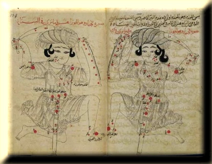
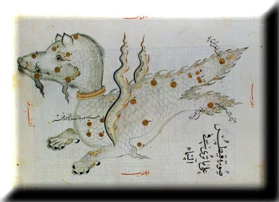

# Arabic

## Introduction

This Arabic sky culture, which is in use for more than a thousand years, had been influenced greatly by Greek astronomy, particularly by Ptolemy's astronomy but also by the nomad's tradition from the Arabic peninsula.

## Description

The depiction of Orion, as seen from Earth (left) and a mirror-image, from a 13th-century copy of al-Sufi's _Book of Fixed Stars_ [#4]. In this version, Orion's shield has become a long sleeve, typical of Islamic dress.
{: .img_and_caption }

_Ptolemy_, the Greek astronomer who lived and worked around _100-178 CE_ in Alexandria, Egypt, collected ancient Greek descriptions of 1,022 stars in his famous book _The Great System of Astronomy_, popularised under its shortened Arabic title, the _Almagest_.
Ptolemy's catalogue of stars listed orthogonal coordinates in the ecliptical coordinate system and brightness estimates for the stars arranged in _48 constellations_ As Ptolemy's work was largely based on his predecessors in Greek mathematical astronomy, especially _Hipparchus_, his book has been considered the last compendium of ancient knowledge.

Ptolemy's _Almagest_ was translated into Arabic twice in the 9th century and the Arabic translation was translated into Medieval Latin earlier than the Greek original. Thus, many modern star names are (or are based on) the star descriptions in the Arabic Almagest.

### Constellations

This Arabic sky culture uses the classical _48 constellations_ of the Greek _Almagest_.
These constellations were described by several Arab and Islamic authors, one of those who left an indelible influence on the Arabic observation and study of stars is the astronomer _Abū al-Husayn ‘Abd Al-Rahmān al-Sūfī_ (903-986), known also by his Latinized name of _Azophi_, who systematically revised Ptolemy's catalogue of stars.
_Al-Sūfī_ produced a revised and updated version of Ptolemy's _Almagest_ in a major book called _Kitab suwar al-kawakib_, _The Book of Fixed Stars_ [#4], completed around 964 CE.
Built on the basis of the Greek astronomical heritage, the work of _Al-Sūfī_ contained a listing of the Arabs' own star names, magnitudes determined by _al-Sūfī_ himself, and two drawings of each constellation, one as it is seen in the sky and one reversed right to left as it would appear on a celestial globe.
The oldest surviving copy was produced by his son around _1010 CE_ and is preserved in the Bodleian Library, Oxford (MS Marsh 144).

Cetus as seen in the sky in an old manuscript of Al-Sufi book [#3].
{: .img_and_caption }

### The origin of star names

Almost all modern star names originate from long traditions. They are a part of the collective cultural heritage of humanity. 

 The majority of common star names in the Western cultures is Arabic or derives from abbreviations and misunderstandings of Arabic phrases. This way, only star names (labels) for bright stars survived in abbreviations and transcriptions. 
 
 For instance, in the Almagest, stars were described by their position within the constellation figure, e.g. "the star at the tip of the tail of the Bird". This was translated into Arabic but in the map the label was reduced to the term "tail" (the figure of the bird is obvious), "danab" in Arabic. The translation into Latin, then, transformed the "Bird" into "Swan" _Cygnus_ and the Arabic label was taken as star name _Deneb_. Other star names used by _al-Sūfī_ and his compatriots were direct translations from Ptolemy's descriptions. For example, the modern star name _Fomalhaut_ comes from the Arabic "mouth of the southern fish", which is where _Ptolemy_ had described the star's position in the _Almagest_.
 
 Other star names describe the star itself, such as _Sirius_, which is derived from  the Greek original and means "the brightest one" (literally as "scorching"). Another name describing the star's appearance is _Algol_, derived from the name of a desert demon whose Arabic name was "The Ghoul", at the eye of a demon figure as if the demon twinkeled at us. Quite a lot of prominent stars bear Arabic names, in which "al" corresponds to the article "the" but its inclusion has become somewhat arbitrary over time. Several star names of Arabic origin are given with or without the al- prefix. 

When the Arabic texts were translated into Latin from the beginning of the _12th century_ on, the Arabic tradition of star names was passed down to the Latin world. However, this happened often in a highly corrupted form that either changed the meaning, or in extreme cases gave birth to words with no meaning at all. Other names were mistakenly transferred from one star to another, so that a name might even refer to a different constellation (Greek or Arabic) rather than to the one of the star's actual location.

Of course, there are also star names from other than the Arabic language: Some names are inherited from the past have _Greek_, _Latin_ or _Chinese_.
Nevertheless, even with the above mentioned shortcomings, the majority of star names adopted since the Renaissance time is of Arabic origin. 

Local tradition of the peoples of _Islamic lands_ in the Arabian Peninsula and in the Middle East had their own names for various bright stars such as _Aldebaran_, The Follower (of the Star Cluster we name the Pleiades). They usually regarded single stars as representing _animals or people_, e.g. Diphda (_beta Ceti_), the Second Frog. The stars we know as _Alpha_ and _Beta Ophiuchi_ were regarded as a _shepherd_ and _his dog_, while neighbouring stars made up the outlines of a _field with sheep_. Some of the Arabic names were already many centuries old and their meanings were lost even for _al-Sūfī_ and his contemporaries, and they remain unknown until today. 

### Thanks

 - [The Arab Astronomy Forum](http://www.jas.org.jo/forum/viewtopic.php)
 - [The Islamic Crescent's Observation Project "ICOP"](http://www.icoproject.org/star.html) for granting a permission to use there lists of "Arabic" Constellations and star names.
 - Arabic Stellarium Translation team

## References

 - [#1]: Star Tales on [Ian Ridpath website](http://www.ianridpath.com/startales/startales1b.htm)
 - [#2]: Abd al-Rahman Al-Sufi [article on Wikipedia](http://en.wikipedia.org/wiki/Abd_al-Rahman_al-Sufi)
 - [#3]: Constellations Illustrations by Al-Sufi. Images of a manuscript of Al-Sufi book with sample artistic illustrations and star table samples. [Link](http://www.atlascoelestis.com/alsufi%20Suwar.htm)
 - [#4]: The Original manuscript of Al-Sufi's "Kitab suwar al-kawakib" (The Book of Fixed Stars). Paris Digital Library "Gallica". [Link](http://gallica.bnf.fr/ark:/12148/btv1b60006156.image.f7.pagination)
 - [#5]: List of Arabic Star Names [article on Wikipedia](http://en.wikipedia.org/wiki/List_of_Arabic_star_names).
 - [#6]: Richard Hinckley Allen. _Star Names — Their Lore and Meaning_. [Link](http://penelope.uchicago.edu/Thayer/E/Gazetteer/Topics/astronomy/_Texts/secondary/ALLSTA/home.html)
 - [#7]: Islamic science heritage. _Arabic Star Names: A Treasure of Knowledge Shared by the World._ [Link](http://www.muslimheritage.com/article/arabic-star-names-treasure-knowledge-shared-world)

## Authors

The Arabic star names were compiled and added to Stellarium by Khalid Alajaji.
Constellation lines, images & English translation by [Kutaibaa Akraa](email:kutaibaa@gmail.com).
Rework of the English text: Susanne M Hoffmann

## Licence

GNU GPL v2.0
