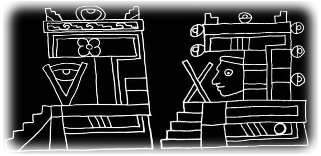
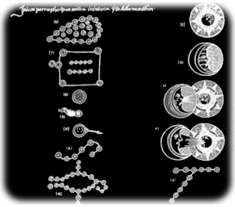
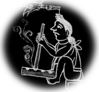
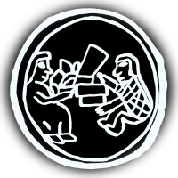
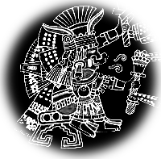
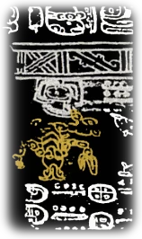

# Aztec

## Introduction

For ancient aztecs, the knowledge of the night skies and stars movement had
great importance for their calendars and the measurement of both agricultural
and sacred cycles.

## Description

The Aztecs were a group of indigenous peoples in Mesoamerica, especially in
central parts of Mexico. Their culture flourished from 13th to 15th century but
a great part of their knowledge was lost as a consequence of the Spanish
conquest which occurred in the 16th century.

The elements of the Aztec society such as culture, economy and science are
preserved in the _tlacuilos_. This term loans from _tlacuiloa_, a word in the
ancient Aztec language (Nahuatl [#12][#13]) that means _writing with
drawings_. These Tlacuilos where stored in the _amoxcalli_ (books) and _calli_
(house). Later, they became known as _codices_; a word that came from the Latin
word Codex meaning 'written book'. They were drawn in many different materials
such as deer skin, _amate_ (paper) or cotton fabric and they had no text only
drawings called _glifos_ [#5][#6].

Although, many of the pre-hispanic Codices were destroyed during the Spanish
conquest, some native Americans and some Spanish priests have been working for
keeping collections and continuing the Mesoamerican customs from earlier
epochs. In the newly produced Colonial Codices, there is a change of the
drawing style because of new techniques and the new materials imported from
Europe. Additionally, descriptive text in these new manuscripts have been
written in a mixture of both languages, Spanish and Nahuatl.

Astronomical building
{: .img_and_caption }

Sadly, the Aztec astronomical knowledge in the remaining codexes is really
small. The next image is one of the few that names some constellations and
astronomical phenomena identified by the Aztec, it belong to the _Primeros
Memoriales_ (first memorials), a colonial manuscript of the 16th century
written by Fray Bernardino de Sahagun.

### Conclusion

It is noteworthy that the interpretation of some of these constellations are
still in discussion, and of course there must be other constellations to
represent. Any comments and/or collaboration are welcome in order to preserve
the stellar knowledge, myths and starlore of the Aztec culture.

## Constellations

##### Mamalhuaztli

Ancient Aztec named Orion's Belt 'Mamalhuaztli'. It represented the wood sticks
used to light the new fire in the commemoration celebrated every 52 years by
the Mexicans and their neighbors. This celebration was named _toxiuh molpilia_
which means 'binding of the years' and coincided with the beginning of the new
year named _xiuhtzitzquilo_.

##### Tianquiztli

For the Mexicans, the group of stars known as Pleiades symbolized _Tianquiztli_
(the Market), perhaps because of the crowd that gathers on them. Normally, they
are represented by one or two people inside a circle with goods.

Nowadays, in Mexico the informal market or street markets are called _Tianguis_.

##### Citlaltlachtli

The constellation of Gemini was called _Citlaltlachtli_, which means the ball
game of the stars. This game was endowed with a ritual significance and used a
natural rubber ball. It is said that the movement of the ball within the
playing field refers to the movement of the Sun and Moon.

##### Xonecuilli

The constellation of Ursa Minor, the Little Bear, is identified as _Xonecuilli_
(the Twisted foot). It is related to _Nanahuatzin_, a character represented
with twisted feet, filled with boils and sores. This sick and poor God
sacrificed himself to become _Tonatiuh_, the Sun god.

Apparently, this constellation name can also be associated with the Southern
Cross and its surrounding stars (especially in texts by Tezozomoc). The Spanish
missionary priest Sahagún reports [#7], the shape of this constellations
resembles a bread in the form of the letter S and it is called _xonecuilli_ by
the Aztecs.

Xonecuilli
{: .img_and_caption }

##### Colotl Ixayac

According to the Florentino Codex, Sahagun's informants identified a group of
stars known as _Citlalcolotl_ with the stars of the Scorpion. In turn,
Tezozomoc also mentions the scorpion star and he called it _Colotlixayac_,
which means face of a scorpion.

In a section of the Paris Codex called zodiac pages [#3],[#10], the scorpion is
also mentioned. In this codex the icons shows figures of animals hanging from
the body of the Celestial Dragon.
{: .img_and_caption }

## References

 - [#1]: [Fuego Nuevo](http://biblioteca.itam.mx/estudios/estudio/letras30/notas3/sec_1.html)
 - [#2]: [Constelaciones Prehispánicas](http://www.montero.org.mx/constelaciones.htm)
 - [#3]: [The Question of the Zodiac in America](http://www.jstor.org/stable/660290?origin=JSTOR-pdf)
 - [#4]: [Aztec Mythology](http://www.windows2universe.org/mythology/aztec_culture.html)
 - [#5]: [Los códices de México](http://www.iconio.com/ABCD/F/INDEX.PDF)
 - [#6]: [Los códices coloniales de México](http://es.wikipedia.org/wiki/C%C3%B3dices_coloniales_de_M%C3%A9xico)
 - [#7]: Real cédula prohibiendo la historia general de las cosas de Nueva España de Fray Bernardino de Sahagún: [link](http://www.traduccionliteraria.org/1611/esc/america/sahagun.htm)
 - [#8]: repository [Akapochtli](http://commons.wikimedia.org/wiki/User:Akapochtli)
 - [#9]: [Iconografía mexicana, Volumen 3](https://books.google.com.mx/books?id=kxPjdY1PJjEC)
 - [#10]: [El Códice París](http://www.famsi.org/spanish/mayawriting/codices/paris.html)
 - [#11]: [El nacimiento del sol y la luna](http://redescolar.ilce.edu.mx/redescolar/biblioteca/literatura/leyenda/mexicas/mexsolun.html)
 - [#12]: Diccionario náhuatl - español en línea: [AULEX](http://aulex.org/nah-es/)
 - [#13]: language: [Tlachtli](http://sepiensa.org.mx/contenidos/fd_depo/nahuatl/tlach_1.html)

## Authors

[Enrique Gómez Candelario](mailto:aldeaglobal@gmail.com)

English translation by Rafael Rojas Segoviano

Rework by Stellarium's team.

### Thanks

 - Javier Gómez Sandoval
 - Martha Patricia Rivera
 - Emilio Ramón Bolaños Guerra
 - Hector Vega
 - Rafael Rojas Segoviano
 - Juan Caballero
 - SAAGS

## License

GNU GPL v2.0
