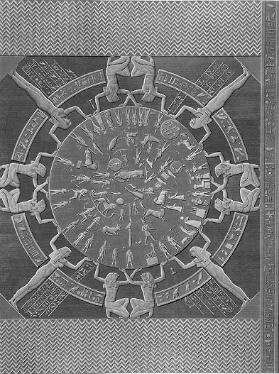

# Egyptian

## Introduction

The late Egyptian sky culture was influenced by Babylonian and Greco-Roman
astronomy. Constellations are depicted on the famous astronomical ceiling from
Denderah.

## Description

The belief that the stars could influence human destinies appears to not have
reached Egypt until the Ptolemaic period. The temple of Hathor at Denderah
dates from Ptolemaic times (probably the first century BCE) and features a
wonderful and huge symbolic map of the sky in Egyptian painting style.

It provides two versions: a circular shaped one [#10] and a rectangularly shaped
one [#11]. The rectangular "zodiac" of Denderah shows a sequence of Egyptian
figures next to a set of symbolic stars indicating how many stars form each
constellations. The round "zodiac" organizes these figures as if they were
placed in the sky.

One of the first depictions of the Dendera "zodiac", produced by
engineer-archaeologists Prosper Jollois and Edouard Devilliers in the 19th
century. The large figure on the right is the Goddess of Heaven, Nut. First
published in: Description de l'Égypte Antiquités, v. 4 [#12]
{: .img_and_caption }

These constellations deviate in naming and depiction from the typical Greek
style:

 * Cancer, the Crab, is represented by the Scarab Beetle.
 * the Big Dipper is not called Bear but "the Bull's Foreleg" refering to the
Foreleg of God Seth, an ancient Egyptian constellation
 * The figure of the Lion near the Scales (which is not the zodiacal Lion) is
the constellation Centaurus [#1].
 * There are two Shooters: one human with two legs, one centaur-like with four
legs. The centaur-like shooter is Sagittarius from the (Babylonian) zodiac, the
human bow-shooter represents the two constellations "Bow" and "Arrow", located
in the modern constellation Canis Maior (the "Arrow" includes Sirius) [#4].

Earlier constellations are more problematic, but some indications exist that
some modern zodiac signs are very ancient indeed [#2][#3][#4][#13], although
the constellations did change significantly over time [#3][#13][#4].

The Egyptians recognized five planets and called them the "stars that knew no
rest" or (more ancient way) "eyes of [god] Horus". Their movement across the
heavens reminded the Egyptians of five gods sailing across the sky in their
solar barque (boat). The planet now known as Jupiter was called "Horus Who
Limits the Two Lands"; Mars was "Horus of the Horizon"; Mercury was "Sebegu",
associated with Set; Saturn was "Horus the Bull of the Sky"; and Venus was "the
God of the Morning" [#8].

## References

 - [#1]: Gary D. Thompson: [Website](http://members.westnet.com.au/gary-david-thompson/page11-11.html)
 - [#2]: Astronomical Artifacts and Cuneiform Tablets: [link](http://members.westnet.com.au/Gary-David-Thompson/page11-15.html)
 - [#3]: [Three archaic Egyptian constellations used as seasonal markers?](http://www.catchpenny.org/thoth/3arch.htm)
 - [#4]: Hoffmann, Susanne M.: Hipparchs Himmelsglobus, Springer, Wiesbaden/ New York, 2017
 - [#5]: Cultural Astronomy: [eCUIP](http://ecuip.lib.uchicago.edu/diglib/science/cultural_astronomy/cultures_egypt-2.html)
 - [#6]: [egyptology online](http://www.egyptologyonline.com/astronomy.htm)
 - [#7]: [Start Teaching Astronomy](http://www.starteachastronomy.com/egyptian.html)
 - [#8]: Pat Remler: Egyptian mythology A to Z / 3rd ed., 2010, Chelsea House, ISBN 978-1-60413-926-6
 - [#9]: Dendera [article on Wikipedia](https://en.wikipedia.org/wiki/Dendera)
 - [#10]: Circular "Zodiac" of Denderah: [Wikimedia](https://upload.wikimedia.org/wikipedia/commons/3/37/Dendera.jpg)
 - [#11]: Rectangular "Zodiac" of Denderah: [Wikipedia](https://en.wikipedia.org/wiki/Egyptian_astronomy#/media/File:Dendera_Deckenrelief_08.JPG)
 - [#12]: [Dendera Zodiac, Linda Hall](https://napoleon.lindahall.org/zodiac_dendera.shtml)
 - [#13]: Hoffmann, S.M.: History of Constellations as popularization of uranometry, in: Wolfschmidt, Gudrun: Nuncius Hamburgensis Bd. 41, tredition Verlag, 2017

## Authors

This sky culture was contributed by _Karrie Berglund_ of Digitalis Education
Solutions, Inc. based on the paper "A Map of the Ancient Egyptian Firmament” by
Juan Antonio Belmonte.

This sky culture was updated by misibacsi (names of planets) and re-worked by
Susanne M Hoffmann.

## License

GNU GPL v2.0
