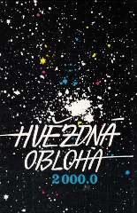
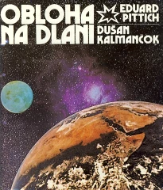

# Modern (O.Hlad,1988)

## Introduction
Nowadays, the sky is devided into 88 areas which have the same names as historical constellations, mostly originating from the ancient Greek star catalogues (see "Modern (default)" sky culture for description). 

However, the International Astronomical Union (IAU) in 1928 only defined the boundaries of these areas [#4] and not the way of drawing artwork within them. This is a version commonly used in Czech publications. 

## Description

The constellations in this sky culture follow the 88 IAU-constellations but the lines connect only bright stars. The sky culture addresses the modern city downtown inhabitant in a light polluted environement.

This set of stickfigures reproduces the classical Czech publication: Hlad, Hovorka, Polechová, Weiselová (1988): Hvězdná obloha 2000.0. Praha: Geodetický a kartografický podnik - according to classical Czech publication [#1].

There are (rather similar) Czech and Slovak references: [#2] and [#3].

These constellation lines are designed to basically connect stars with Greek-letter (α, β, γ, ...) designations, which are the brightest stars of the constellations. In some cases, similarly bright stars without such position in the classical Greek figure are included, especially when they form a mnemotechnic figure (like the 'W' in case of Cas, or 'hurdles-runner' instead of Vir).

Usually, only star brighter than 5th magnitude are used because the fainter ones are difficult to spot in towns. The resulting figures are also a bit simpler and easier-to-remember for children. These constellations are used at the Observatory and Planetarium Hradec Králové in the Czech Republic.

Notes on deviations from the commonly known depiction:

   * UMa is taken from Pittich and Kalmančok (1981); M81 and M82 galaxies are just behind Bear's head.
   * Gem is a similar case.
   * Cam appears upside-down compared to the traditional mythological figure, but HIP 29997, 33694 stars are indeed brighter.

### Updates

Version 1.0 for Stellarium 0.13.1

Future updates should be available at [http://sirrah.troja.mff.cuni.cz/~mira/souhvezdi/](http://sirrah.troja.mff.cuni.cz/~mira/souhvezdi/)

## References

 - [#1]: Hlad, Hovorka, Polechová, Weiselová (1988): _Hvězdná obloha 2000.0_. Praha: Geodetický a kartografický podnik.
 - [#2]: Hlad, Hovorka, Sojka, Weiselová (2000): _Atlas Coeli Novus 2000.0_. Praha: Hvězdárna a planetárium hl. m. Prahy, ETC publishing.
 - [#3]: Pittich, Kalmančok (1981): _Obloha na dlani_. Bratislava: Obzor.

## Authors

Miroslav Broz

Description re-worked by Susanne M Hoffmann

## Licence

GNU GPL v2.0
