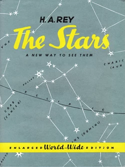

# Modern (H.A.Rey,1952)

## Introduction
Nowadays, the sky is devided into 88 areas which have the same names as historical constellations, mostly originating from the ancient Greek star catalogues (see "Modern (default)" sky culture for description). 

However, the International Astronomical Union (IAU) in 1928 only defined the boundaries of these areas [#4] and not the way of drawing artwork within them. The simplified way of drawing stick figures was made popular since Rey's book in 1952. Thus, several sub-cultures were developed during the past century. 

## Description

Due to the rapidly increasing number of known stars and nebulae, richly illustrated atlases with sumptuously engraved mythological figures had fallen out of fashion in the 19th century. The last atlas of this style was Bode, Uranographia, Berlin, 1801 and its format had to be huge (92 x 130 cm) in order to depict all contemporarily known objects below the detailed drawings. 

The development was split up: The popular maps for beginner's guides and public relation were illustrated with beautiful paintings of constellations but abstained from displying all astronomical content known while the maps used in professional observatories (e.g. the international Cartes du Ciel project) abstained from any lines and constellations drawings but depicted the stars and nebulae only. 

Later, varous artists compete to suggest stick figures that connect some bright stars within the constellation areas but these suggestions were initially not meaningful. Thus, Rey's suggestion in 1952 to draw stick figures that trigger the reader's phantasy had some impact: It shows that over several decades, the figures had ceased to resemble the figures they were named after and appeared incomprehensible to beginning stargazers.

H. A. Rey (Hans Augusto Reyersbach, 1898-1977) was a poster artist of German descent who became extraordinarily successful as author of children's books in New York. His answer to the astronomical stick figure problem is published in the book _The Stars - A New Way To See Them_, (1952).

### The Constellations

In this book, which has become very popular especially in the U.S., Rey connected the stars of every constellation "in such a way that the resulting shape makes sense." What surprised him was "that nobody has done it before. The basic idea is so simple." 

Rey's new stick figures make it indeed very simple to recognize the depicted constellation figures. Rey's work does not include figurative artwork, therefore this sky culture deliberately only comes with Rey's original stick figures. Rey's constellation names were also always given in English. If you switch to "Native" name display mode, you may see exactly the spelling used in his book. Also the stars named here are limited to those included in the book.

### Rey's Figures and the Classic Constellations

Rey's constellations adhere to the tradition of the modern international sky culture of 88 official constellation areas. However, he includes some asterisms commonly used for the orientation, such as the two Northern Dippers of the Greco-Babylonian tradition and the "Great Square" (in Pegasus and Andromeda). However, at several points Rey's figures deviate from the canonical figures described since Ptolemy's Almagest (2nd century AD), where also positions of the stars in their constellations had been described in their names. For example:

*    Rey inverted the figure of the Great Bear (_Ursa Major_) to look like a polar bear scenting prey. On the one hand, this does not have the usual problem to explain its long tail. On the other hand, the bear is not shown to walk around the pole in this orientation.
*   The Bull (_Taurus_), only the front of which is shown with long upright horns in usual depictions, is shown with a complete body including its tail, with horns stretched wide like those of a buffalo. Its bright eye _Aldebaran_ now lies in its neck.
*   The head of _Hercules_ is usually next to the head of _Ophiuchus_, the serpent holder, and the four stars known as "keystone" form his body. Rey makes his head out of the keystone, and the star that usually marks the hero's head is now one of his feet.
*   The Greek Sea Monster (_Cetus_) is translated as "Whale" (like common in German but wrong) and the figure has been turned around, its formermouth now forming a tail fin. 
*   _Pegasus_ exchanged feet and head.
*   _Bootes_, the herdsman, is shown sitting and smoking a pipe (no trace of political correctness in a children's book of the 1950s... :-))

## References

 - [#1]: H.A. Rey [Wikipedia page](http://en.wikipedia.org/wiki/H._A._Rey)

## Authors

Mike Richards and Georg Zotti

This sky culture used to be for a long time an easy user-installable addon example contributed by Mike Richards. It has been reworked following the 41st reprint and completed with this description by Georg Zotti.

Slightly re-worked by Susanne M Hoffmann 

## Licence

GNU GPL v2.0
